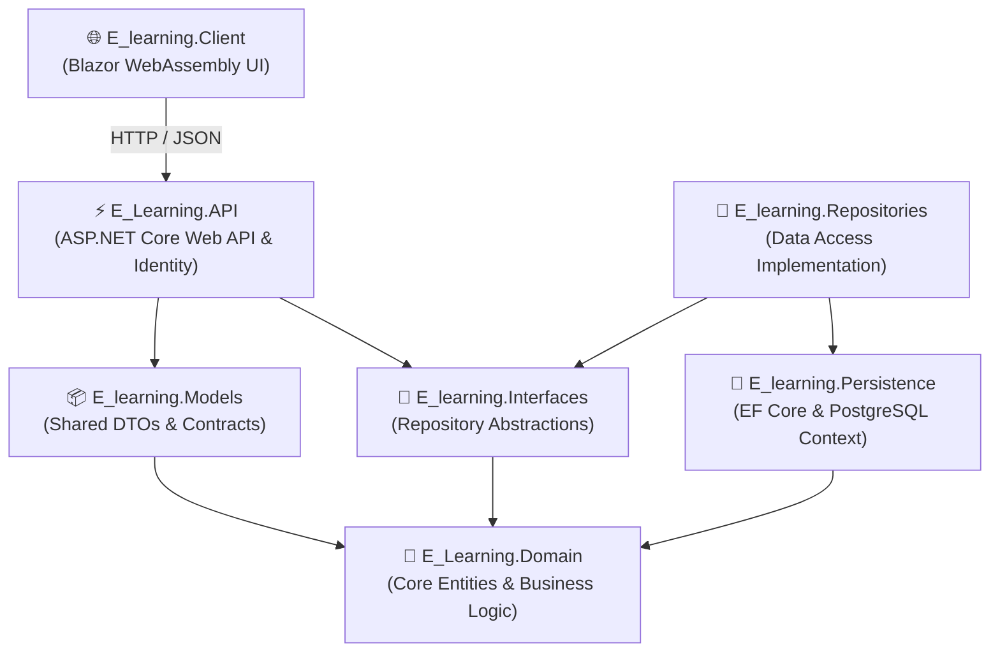

# 🎓 LearnFlow — Modern Enterprise E-Learning Platform

[](https://dotnet.microsoft.com/)
[](https://dotnet.microsoft.com/apps/aspnet/web-apps/blazor)
[](https://learn.microsoft.com/aspnet/core/)
[](https://learn.microsoft.com/ef/core/)
[](https://www.postgresql.org/)
[]()

A full-stack, enterprise-grade educational platform built with **.NET 9**, **Blazor WebAssembly**, and **ASP.NET Core Web API**, architected according to **Clean Architecture** and **Domain-Driven Design (DDD)** principles.

---

## 🏛️ Architecture Overview

The solution follows a multi-project decoupled structure ensuring separation of concerns:



### Projects in Solution:
* **`E_Learning.Domain`**: Core domain entities (`Formation`, `Module`, `Quiz`, `Test`, `Avis`, `Inscription`, `AppUser`).
* **`E_learning.Interfaces`**: Repository contracts and service abstractions.
* **`E_learning.Models`**: Strongly typed Data Transfer Objects (DTOs) shared across API and Client.
* **`E_learning.Persistence`**: Entity Framework Core database context, fluent configurations, and migrations for PostgreSQL.
* **`E_learning.Repositories`**: Concrete implementation of the Repository and Unit of Work patterns.
* **`E_Learning.API`**: RESTful endpoints, JWT / Cookie Identity auth, seeding pipeline.
* **`E_learning.Client`**: Single Page Application (SPA) built with Blazor WebAssembly.

---

## 🔐 Authentication & Role-Based Access Control (RBAC)

Secured using modern ASP.NET Core Identity (`MapIdentityApi<AppUser>()`) with tailored permissions:

| Role | Permissions & Capabilities |
|------|---------------------------|
| 👑 `SuperAdmin` / `Admin` | Full platform administration, category moderation, instructor validation, and user management. |
| 👨‍🏫 `Instructor` | Create and manage courses, curriculum modules, video lessons, quizzes, and grade student submissions. |
| 🎓 `Student` | Browse course catalog, self-enroll, track progression, take timed quizzes, submit assignments, and leave reviews. |

---

## 🚀 Key Functional Modules

* **Course Management:** Hierarchical taxonomy (Categories, Sub-categories, Courses) with difficulty rating and prerequisites.
* **Curriculum & Resources:** Ordered modules containing video streaming links and downloadable documents.
* **Assessment Engine:**
  * Interactive Quizzes (MCQ, True/False) with automated grading and pass-threshold validation.
  * Practical Assignments / Tests with student submission uploads and instructor feedback/scoring.
* **Enrollment & Tracking:** Real-time completion progression tracking for active students.
* **Reviews & Feedback:** Rating and testimonial system calculating dynamic course reputation.

---

## 🛠️ Quick Start

### Prerequisites
* [.NET 9 SDK](https://dotnet.microsoft.com/download/dotnet/9.0)
* [PostgreSQL](https://www.postgresql.org/download/)

### 1. Database Configuration
Update the connection string in `E_Learning.API/appsettings.json`:
```json
{
  "ConnectionStrings": {
    "DefaultConnection": "Host=localhost;Database=elearning_db;Username=postgres;Password=yourpassword"
  }
}
```

### 2. Apply Migrations
```bash
dotnet ef database update --project E_Learning.API --startup-project E_Learning.API
```

### 3. Launch the Backend API
```bash
dotnet run --project E_Learning.API
```

### 4. Launch the Blazor WebAssembly Client
```bash
dotnet run --project E_learning.Client
```

---

## 👥 Authors & Contributors
* **Mahmoud Hentati** ([LinkedIn](https://www.linkedin.com/in/mahmoud-hentati/) • [GitHub](https://github.com/MahmoudHentati))
* **Jihed Hajeb**
* **Yessine**
