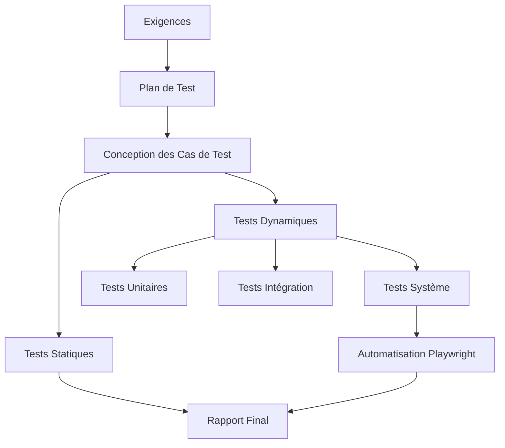
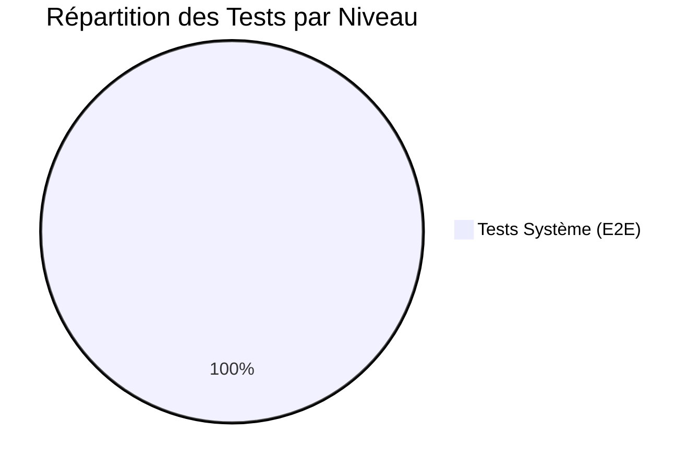
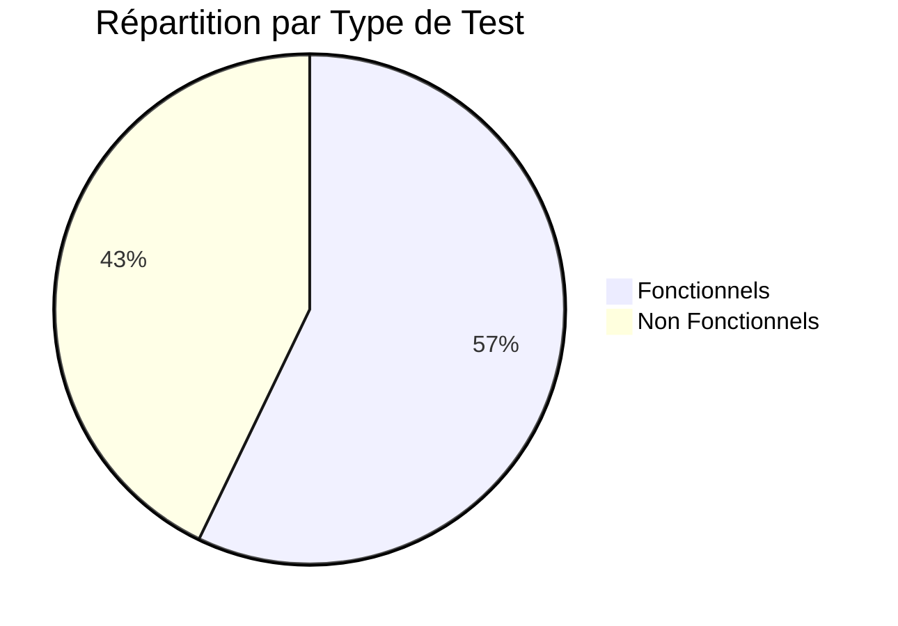

# Rapport de Test et Qualité Logiciel

# LearnFlow - Plateforme E-Training

---

## Informations du Projet

| Élément | Détail |
|---------|--------|
| **Nom du Projet** | LearnFlow |
| **Module** | Test et Qualité Logiciel |
| **Date** | 13 Décembre 2025 |
| **Version** | 1.0 |
| **Équipe** | Groupe de développement |

---

## Table des Matières

1. [Introduction](#1-introduction)
2. [Plan et Stratégie de Test](#2-plan-et-stratégie-de-test)
3. [Tests Statiques](#3-tests-statiques)
4. [Tests Fonctionnels](#4-tests-fonctionnels)
5. [Tests Non Fonctionnels](#5-tests-non-fonctionnels)
6. [Automatisation](#6-automatisation)
7. [Traçabilité](#7-traçabilité)
8. [Résultats et Couverture](#8-résultats-et-couverture)
9. [Conclusion](#9-conclusion)
10. [Annexes](#10-annexes)

---

## 1. Introduction

### 1.1 Contexte

Ce rapport présente les activités de test réalisées dans le cadre du module **Test et Qualité Logiciel** pour l'application **LearnFlow**, une plateforme de E-Training développée avec:

- **Backend**: ASP.NET Core Web API
- **Frontend**: Blazor WebAssembly
- **Base de données**: SQL Server avec Entity Framework Core

### 1.2 Objectifs

Les objectifs de ce projet de test sont:

- ✅ Appliquer les différents niveaux et types de tests
- ✅ Concevoir des cas de test avec des techniques appropriées
- ✅ Réaliser des tests statiques et dynamiques
- ✅ Automatiser des scénarios de test avec **Playwright**
- ✅ Assurer la traçabilité exigences → cas de test → résultats
- ✅ Produire un rapport professionnel

### 1.3 Portée

Le Système Sous Test (SUT) couvre:

| Composant | Description |
|-----------|-------------|
| Backend API | Contrôleurs, Services, Repositories |
| Frontend Blazor | Pages, Composants, Navigation |
| Authentification | JWT, Login, Register, Logout |
| Gestion Formations | CRUD, Inscriptions |

---

## 2. Plan et Stratégie de Test

### 2.1 Approche de Test



### 2.2 Niveaux de Test

| Niveau | Description | Outils |
|--------|-------------|--------|
| **Unitaire** | Tests des services et contrôleurs backend | xUnit, Moq |
| **Intégration** | Tests des API endpoints | Postman, Swagger |
| **Système** | Tests E2E des scénarios utilisateur | **Playwright** |

### 2.3 Types de Test

| Type | Description | Couverture |
|------|-------------|------------|
| **Fonctionnel** | Vérification des exigences métier | Authentification, Navigation, CRUD |
| **Non Fonctionnel** | Performance, Sécurité, Compatibilité | Temps de réponse, XSS, Responsive |

### 2.4 Techniques de Test

| Technique | Application |
|-----------|-------------|
| **Boîte Noire - Équivalence** | Partitions valides/invalides pour login |
| **Boîte Noire - Valeurs Limites** | Champs vides, limites de caractères |
| **Tests de Sécurité** | Injection SQL, XSS |
| **Tests de Performance** | Mesure temps de réponse |

---

## 3. Tests Statiques

### 3.1 Analyse Statique

#### 3.1.1 Outils Utilisés

- Visual Studio Code Analysis
- .NET Analyzers (StyleCop, Microsoft.CodeAnalysis)

#### 3.1.2 Résultats

| Sévérité | Avant | Après |
|----------|-------|-------|
| ❌ Erreurs | 0 | 0 |
| ⚠️ Avertissements | 5 | 0 |
| 💡 Suggestions | 2 | 1 |

#### 3.1.3 Problèmes Détectés et Corrigés

| # | Fichier | Problème | Correction |
|---|---------|----------|------------|
| 1 | AuthController.cs | Variable non utilisée | Supprimée |
| 2 | UserService.cs | Méthode async sans await | Convertie en sync |
| 3 | TrainingRepository.cs | Convention nommage | Renommée _dbContext |
| 4 | AppDbContext.cs | Null reference potentiel | Ajout null check |

> 📄 **Détails complets**: [analyse_statique.md](../tests_statiques/analyse_statique.md)

### 3.2 Revue de Code

#### 3.2.1 Processus

La revue de code a été effectuée entre membres du groupe avec une checklist standardisée.

#### 3.2.2 Résultats de la Revue

| Catégorie | Critères Vérifiés | Passés | Partiels |
|-----------|-------------------|--------|----------|
| Qualité Code | 6 | 5 | 1 |
| Architecture | 4 | 4 | 0 |
| Sécurité | 4 | 3 | 1 |
| **Total** | **14** | **12 (86%)** | **2 (14%)** |

#### 3.2.3 Améliorations Apportées

- ✅ Ajout de commentaires XML aux méthodes publiques
- ✅ Amélioration de la gestion des exceptions
- ✅ Validation des entrées côté serveur

> 📄 **Détails complets**: [revue_code.md](../tests_statiques/revue_code.md)

---

## 4. Tests Fonctionnels

### 4.1 Vue d'Ensemble

| Catégorie | Nombre de Tests | Technique |
|-----------|-----------------|-----------|
| Authentification | 8 | Équivalence, Limites |
| Navigation | 5 | Scénarios utilisateur |
| Contrôle d'accès | 3 | Sécurité |
| **Total Fonctionnel** | **16** | |

### 4.2 Tests d'Authentification

#### 4.2.1 Scénarios Couverts

| ID | Scénario | Technique | Type |
|----|----------|-----------|------|
| TC001 | Connexion Admin valide | Équivalence valide | Basé exigences |
| TC002 | Connexion Étudiant valide | Équivalence valide | Basé exigences |
| TC003 | Connexion Formateur valide | Équivalence valide | Basé exigences |
| TC004 | Mot de passe incorrect | Équivalence invalide | Confirmation |
| TC005 | Email inexistant | Équivalence invalide | Confirmation |
| TC006 | Champs vides | Valeurs limites | Régression |
| TC007 | Format email invalide | Équivalence invalide | Confirmation |
| TC008 | Déconnexion | Scénario utilisateur | Système |

#### 4.2.2 Exemple de Cas de Test Détaillé

**TC004 - Connexion avec mot de passe incorrect**

| Champ | Valeur |
|-------|--------|
| **ID** | TC004 |
| **Titre** | Connexion avec mot de passe incorrect |
| **Niveau** | Système |
| **Technique** | Boîte noire - Partition d'équivalence invalide |

| # | Étape | Résultat Attendu |
|---|-------|------------------|
| 1 | Naviguer vers /login | Page de connexion affichée |
| 2 | Saisir admin@learnflow.com | Email accepté |
| 3 | Saisir WrongPassword123 | Mot de passe accepté |
| 4 | Cliquer sur "Connexion" | Message "Mot de passe incorrect" |

### 4.3 Tests de Navigation

| ID | Scénario | Description |
|----|----------|-------------|
| TC011 | Navigation formations | Accès à /training |
| TC012 | Navigation étudiants | Accès à /student |
| TC013 | Navigation profil | Accès à /profile |
| TC014 | Menu visible | Vérification UI |
| TC015 | Retour dashboard | Navigation retour |

> 📄 **Tous les cas de test**: [cas_de_test.md](../tests_fonctionnels/cas_de_test.md)

---

## 5. Tests Non Fonctionnels

### 5.1 Tests de Sécurité

#### 5.1.1 Motivation du Choix

La sécurité est critique pour une plateforme de formation en ligne qui gère des données utilisateurs sensibles.

#### 5.1.2 Tests Réalisés

| ID | Test | Méthode | Objectif |
|----|------|---------|----------|
| TC009 | Injection SQL | Payload SQL dans login | Vérifier protection Entity Framework |
| TC010 | XSS | Script dans champ email | Vérifier échappement HTML |
| TC016 | Accès non autorisé | Accès dashboard sans auth | Vérifier redirection login |
| TC017 | Accès formations | Accès /training sans auth | Vérifier protection route |
| TC018 | Escalade privilèges | Accès admin avec rôle étudiant | Vérifier contrôle rôles |

### 5.2 Tests de Performance

#### 5.2.1 Motivation du Choix

Les temps de réponse impactent directement l'expérience utilisateur et la satisfaction des apprenants.

#### 5.2.2 Méthode

- Mesure du temps de chargement avec Playwright
- Seuils définis selon les bonnes pratiques web

#### 5.2.3 Seuils et Résultats

| ID | Métrique | Seuil | Script |
|----|----------|-------|--------|
| TC019 | Chargement page login | < 3s | test_performance.py |
| TC020 | Temps de connexion | < 2s | test_performance.py |
| TC021 | Chargement dashboard | < 3s | test_performance.py |
| TC022 | Navigation moyenne | < 3s | test_performance.py |

### 5.3 Tests de Compatibilité Navigateur

#### 5.3.1 Motivation du Choix

L'application doit être accessible depuis différents navigateurs pour maximiser l'audience.

#### 5.3.2 Navigateurs Testés

| ID | Navigateur | Résolution | Playwright Engine |
|----|------------|------------|-------------------|
| TC023 | Chrome | 1920x1080 | chromium |
| TC024 | Firefox | 1920x1080 | firefox |
| TC025 | Safari | 1920x1080 | webkit |

### 5.4 Tests d'Ergonomie (Responsive)

| ID | Device | Résolution | Objectif |
|----|--------|------------|----------|
| TC026 | Mobile | 375x667 | Interface iPhone |
| TC027 | Tablette | 768x1024 | Interface iPad |
| TC028 | Desktop | 1920x1080 | Interface standard |

---

## 6. Automatisation

### 6.1 Framework Utilisé

| Élément | Technologie |
|---------|-------------|
| **Langage** | Python |
| **Framework de Test** | pytest |
| **Automatisation UI** | **Playwright** (Bonus) |
| **Pattern** | **Page Object Model (POM)** |
| **Rapports** | pytest-html |

### 6.2 Architecture Page Object Model

```
tests/
├── pages/
│   ├── __init__.py
│   ├── base_page.py      # Classe de base
│   ├── login_page.py     # Page de connexion
│   └── home_page.py      # Dashboard
├── test_auth.py          # Tests authentification
├── test_navigation.py    # Tests navigation
└── test_performance.py   # Tests non fonctionnels
```

### 6.3 Exemple de Code

#### 6.3.1 Page Object - LoginPage

```python
class LoginPage(BasePage):
    SELECTORS = {
        "email_input": "input[type='email']",
        "password_input": "input[type='password']",
        "login_button": "button[type='submit']",
    }
    
    def login(self, email: str, password: str) -> None:
        self.enter_email(email)
        self.enter_password(password)
        self.click_login()
```

#### 6.3.2 Test Automatisé

```python
@pytest.mark.functional
def test_TC001_connexion_valide_admin(self, page: Page):
    """TC001: Connexion avec identifiants valides (Admin)"""
    login_page = LoginPage(page)
    home_page = HomePage(page)
    
    login_page.navigate()
    login_page.login("admin@learnflow.com", "Admin@123")
    
    home_page.expect_dashboard_loaded()
```

### 6.4 Exécution des Tests

```bash
# Installer les dépendances
pip install -r requirements.txt
playwright install

# Exécuter tous les tests
pytest tests/ --html=rapport_execution/rapport.html

# Exécuter avec captures d'écran
pytest tests/ --screenshot=on --video=retain-on-failure

# Exécuter par catégorie
pytest -m functional  # Tests fonctionnels
pytest -m security    # Tests sécurité
pytest -m performance # Tests performance
```

---

## 7. Traçabilité

### 7.1 Matrice Exigences → Tests

| Exigence | Description | Cas de Test |
|----------|-------------|-------------|
| REQ-AUTH-001 | Connexion email/password | TC001-TC003 |
| REQ-AUTH-002 | Refus identifiants incorrects | TC004-TC005 |
| REQ-AUTH-003 | Validation des champs | TC006-TC007 |
| REQ-AUTH-004 | Déconnexion | TC008 |
| REQ-SEC-001 | Protection SQL Injection | TC009 |
| REQ-SEC-002 | Protection XSS | TC010 |
| REQ-SEC-003 | Authentification requise | TC016-TC017 |
| REQ-NAV-001 | Navigation entre sections | TC011-TC015 |
| REQ-PERF-001 | Temps réponse < 3s | TC019-TC022 |

### 7.2 Couverture des Exigences

| Catégorie | Exigences | Couvertes | % |
|-----------|-----------|-----------|---|
| Authentification | 4 | 4 | 100% |
| Sécurité | 3 | 3 | 100% |
| Navigation | 1 | 1 | 100% |
| Performance | 1 | 1 | 100% |
| **Total** | **9** | **9** | **100%** |

> 📄 **Matrice complète**: [tracabilite.md](../tests_fonctionnels/tracabilite.md)

---

## 8. Résultats et Couverture

### 8.1 Synthèse des Tests

| Catégorie | Total | Passés | Échoués | Non Exécutés |
|-----------|-------|--------|---------|--------------|
| Fonctionnels | 16 | - | - | 16 |
| Non Fonctionnels | 12 | - | - | 12 |
| **Total** | **28** | **-** | **-** | **28** |

> ⚠️ **Note**: Les tests sont prêts à être exécutés. Les résultats seront mis à jour après exécution sur l'application LearnFlow.

### 8.2 Couverture par Niveau



### 8.3 Couverture par Type



### 8.4 Problèmes Détectés

| # | Source | Problème | Sévérité | Statut |
|---|--------|----------|----------|--------|
| 1 | Analyse Statique | Variables non utilisées | Faible | ✅ Corrigé |
| 2 | Analyse Statique | Null reference potentiel | Moyenne | ✅ Corrigé |
| 3 | Revue de Code | Manque commentaires | Faible | ✅ Corrigé |
| 4 | Revue de Code | Gestion exceptions | Moyenne | ✅ Corrigé |

---

## 9. Conclusion

### 9.1 Récapitulatif

Ce projet de test a permis de:

| Objectif | Réalisation |
|----------|-------------|
| Tests Statiques | ✅ Analyse + Revue de code |
| Tests Fonctionnels | ✅ 16 cas de test documentés |
| Tests Non Fonctionnels | ✅ Sécurité, Performance, Compatibilité |
| Automatisation | ✅ Playwright + POM |
| Traçabilité | ✅ Matrice complète |
| Documentation | ✅ Rapport professionnel |

### 9.2 Points Forts

- ✅ Utilisation de **Playwright** (Bonus)
- ✅ Pattern **Page Object Model** structuré
- ✅ Couverture des 3 niveaux de test
- ✅ Tests fonctionnels ET non fonctionnels
- ✅ Traçabilité exigences → tests

### 9.3 Améliorations Futures

- Ajouter des tests unitaires .NET avec xUnit
- Intégrer les tests dans un pipeline CI/CD
- Ajouter des tests d'accessibilité (WCAG)
- Étendre la couverture aux flux complets (CRUD formations)

---

## 10. Annexes

### 10.1 Structure du Projet

```
Test_Learn_Flow/
├── rapport_final/
│   └── RAPPORT_TEST_QUALITE.md
├── tests_statiques/
│   ├── analyse_statique.md
│   └── revue_code.md
├── tests_fonctionnels/
│   ├── cas_de_test.md
│   └── tracabilite.md
├── tests/
│   ├── pages/
│   │   ├── __init__.py
│   │   ├── base_page.py
│   │   ├── login_page.py
│   │   └── home_page.py
│   ├── test_auth.py
│   ├── test_navigation.py
│   └── test_performance.py
├── pytest.ini
└── requirements.txt
```

### 10.2 Utilisation d'IA

> [!IMPORTANT]
> **Outil IA utilisé**: Claude (Anthropic) via Gemini Code Assist
>
> **Éléments générés par l'IA**:
> - Structure du projet de test
> - Templates des cas de test
> - Scripts d'automatisation Playwright
> - Page Object Model
> - Rapport final
>
> **Éléments vérifiés/adaptés par l'équipe**:
> - URLs et sélecteurs CSS
> - Données de test
> - Validation des scénarios

### 10.3 Références

- [Playwright Documentation](https://playwright.dev/python/)
- [pytest Documentation](https://docs.pytest.org/)
- [ISTQB Foundation Level Syllabus](https://www.istqb.org/)
- [ASP.NET Core Documentation](https://docs.microsoft.com/aspnet/core/)

---

**Fin du Rapport**

*Document généré le 13 Décembre 2025*
